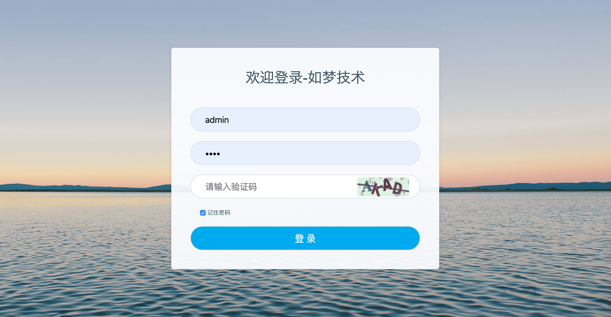
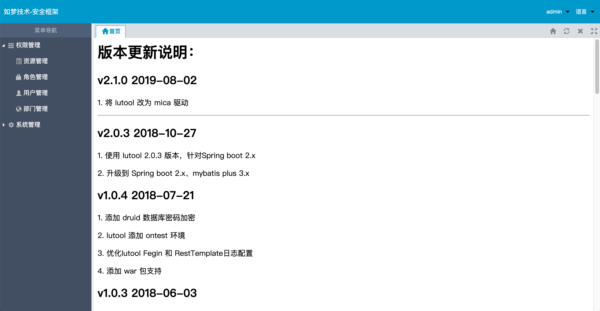
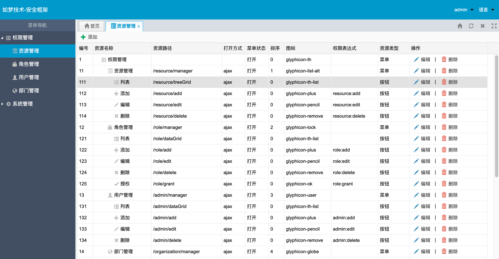

## 如梦安全系统
基于底层基于 [**mica**](https://gitee.com/596392912/mica) 驱动，采用 maven、spring boot、spring security、thymeleaf 的权限管理系统。

### 1. 文档
- sql文件请查看`docs/mysql.sql`。
- `application.yml`放置公共配置，`application-xxx.yml`放置`差异`性环境的配置。
- 环境划分文档：https://www.dreamlu.net/docs/launcher-profile.html

### 2. 最佳实践
1. 先设计好数据库，注意表名，字段名填写清楚。

2. 运行 `src/test/java/net/dreamlu/generator/MysqlGenerator.java` 中的main方法生成基础代码。

3. 代码生成`jdbc配置`和`模板`详见`test/resources`。

### 3. 效果图

### 4. TODO
- 在线用户管理

### 5. 技术咨询
- QQ群(`新`)：479710041
- QQ群(`满`)：523720304

### 6. 默认账号
- 本地用户名：admin、test 密码：test

### 7. 在线 demo
- 地址：http://demo.dreamlu.net

- 账号vs密码：test、test

### 8. 界面参考
- Zcurd快速开发平台：https://gitee.com/515097842/zcurd

### 9. 推荐
Spring boot 高效开发之 **Mica** 工具集：[https://gitee.com/596392912/mica](https://gitee.com/596392912/mica)

### License

( Apache License v2.0 )

### 微信公众号

精彩内容每日推荐！！！